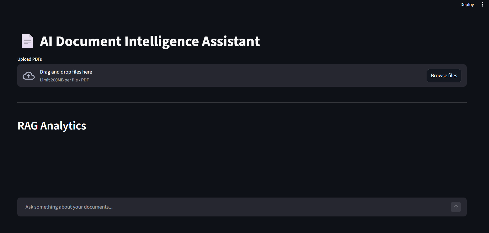
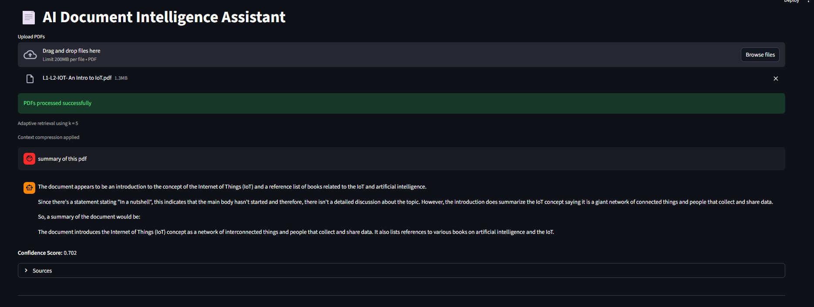
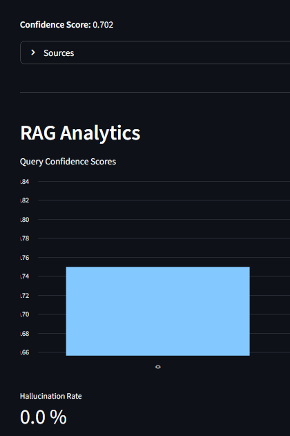

# Advanced RAG Document Assistant

An AI-powered document question answering system built using an advanced Retrieval-Augmented Generation (RAG) pipeline.

This system allows users to upload multiple PDFs and ask questions about the documents using an LLM-powered interface.

---

## Features

- Multi-PDF document ingestion
- Hybrid retrieval (FAISS + BM25)
- Query expansion
- Cross-encoder reranking
- Adaptive retrieval
- Context compression
- Semantic caching
- Hallucination detection
- Confidence scoring
- RAG analytics dashboard
- Interactive Streamlit UI

---

## Architecture

PDF Upload  
↓  
Text Chunking  
↓  
Embedding Generation (Sentence Transformers)  
↓  
Hybrid Retrieval (FAISS + BM25)  
↓  
Query Expansion  
↓  
Cross Encoder Re-ranking  
↓  
Context Compression  
↓  
LLM Generation (Groq LLaMA Model)  
↓  
Answer + Confidence Score + Source Pages

---

## Installation

Clone the repository

```bash
git clone https://github.com/KrunalKayasth26/advanced-rag-document-assistant.git
cd advanced-rag-document-assistant
```

Install dependencies

```bash
pip install -r requirements.txt
```

Create a `.env` file in the root directory

```
GROQ_API_KEY=your_api_key_here
```

Run the application

```bash
streamlit run streamlit_app.py
```

---

## Tech Stack

- Python
- LangChain
- FAISS Vector Database
- BM25 Retriever
- Sentence Transformers
- Groq LLM
- Streamlit
- Cross-Encoder Re-ranking

---

## Project Structure

```
advanced-rag-document-assistant
│
├── utils
│   ├── adaptive_retrieval.py
│   ├── analytics.py
│   ├── chunking.py
│   ├── context_compression.py
│   ├── embeddings.py
│   ├── pdf_loader.py
│   ├── query_expansion.py
│   └── semantic_cache.py
│
├── app.py
├── streamlit_app.py
├── evaluation.py
├── requirements.txt
├── .env.example
└── .gitignore
```
# Advanced RAG Document Assistant

## Screenshots

### Interface


### Question Answering


### Analytics Dashboard

---

## Author

**Krunal Kayasth**

MTech Artificial Intelligence Student  
Pandit Deendayal Energy University

---

## Future Improvements

- Multi-vector retrieval
- OCR support for scanned PDFs
- Better RAG evaluation metrics
- Document summarization module
